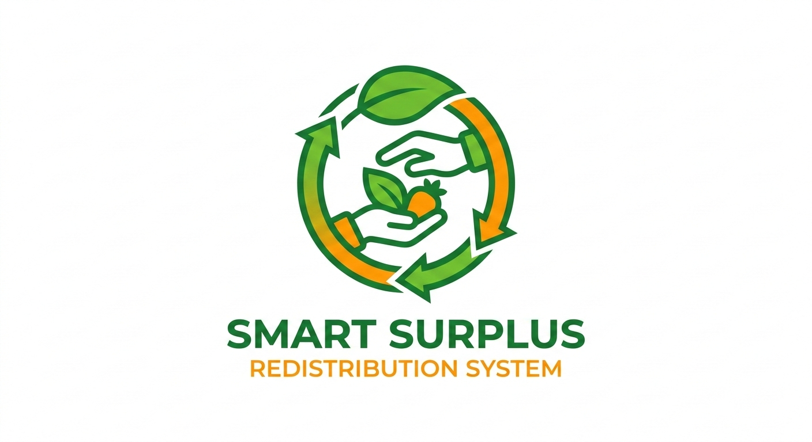

<div align="center">

<br/>



<br/><br/>

```
██████╗ ███████╗███████╗ ██████╗██╗   ██╗███████╗███╗   ██╗███████╗████████╗
██╔══██╗██╔════╝██╔════╝██╔════╝██║   ██║██╔════╝████╗  ██║██╔════╝╚══██╔══╝
██████╔╝█████╗  ███████╗██║     ██║   ██║█████╗  ██╔██╗ ██║█████╗     ██║   
██╔══██╗██╔══╝  ╚════██║██║     ██║   ██║██╔══╝  ██║╚██╗██║██╔══╝     ██║   
██║  ██║███████╗███████║╚██████╗╚██████╔╝███████╗██║ ╚████║███████╗   ██║   
╚═╝  ╚═╝╚══════╝╚══════╝ ╚═════╝ ╚═════╝ ╚══════╝╚═╝  ╚═══╝╚══════╝   ╚═╝   
```

### *Smart Surplus Food Redistribution System*

> **"One-third of all food produced is wasted — while 800 million people go hungry."**
> RescueNet exists to close that gap.

<br/>

[](https://reactjs.org/)
[](https://typescriptlang.org/)
[](https://nodejs.org/)
[](https://mongodb.com/)
[](https://socket.io/)
[](https://tailwindcss.com/)

<br/>

[]()
[]()
[]()

<br/>

---

## 🌍 The Mission

```
        🍱 Donor               🚴 Volunteer              🏠 Recipient
    lists surplus food   →   accepts & delivers   →   receives hot meal
         in 30s                  in minutes               for free
```

**RescueNet** is a real-time food redistribution platform connecting restaurants, bakeries,
and households with surplus food to local volunteers and people who need it most.

---

## ⚡ What Makes It Special

<br/>

🔴 **LIVE** &nbsp;&nbsp; Real-time notifications via Socket.io — know the moment food is available

🗺️ **MAPPED** &nbsp;&nbsp; Google Maps integration — search, GPS, or drop a pin for pickup

⏱️ **TIMED** &nbsp;&nbsp; Auto-expiry countdowns — food listed with urgency windows

📊 **TRACKED** &nbsp;&nbsp; Full analytics — meals saved, people helped, impact over time

🔒 **SECURED** &nbsp;&nbsp; JWT auth, role-based access — 4 distinct user roles

📱 **RESPONSIVE** &nbsp;&nbsp; Seamless on mobile, tablet and desktop

<br/>

---

## 👥 Four Roles. One Goal.

<br/>

| | Role | What They Do |
|---|---|---|
| 🧑‍🍳 | **Donor** | Lists surplus food with photos, categories, allergens & expiry windows |
| 🙋 | **Recipient** | Browses & claims nearby available food in real time |
| 🚴 | **Volunteer** | Accepts deliveries, navigates to pickup, marks completion |
| 🛡️ | **Admin** | Manages users, monitors system health, views analytics |

<br/>

---

## 🛠️ Built With

<br/>

```yaml
Frontend:
  - React 18 + TypeScript        # Type-safe component architecture
  - Tailwind CSS                 # Utility-first responsive styling
  - Redux Toolkit + React Query  # Global state + server state
  - React Router DOM v6          # Client-side routing
  - Socket.io Client             # Real-time bidirectional events
  - @react-google-maps/api       # Maps, Places & Geocoding
  - Lucide React                 # Clean icon system

Backend:
  - Node.js 20 + Express 4       # RESTful API server
  - MongoDB + Mongoose           # Document database + ODM
  - Socket.io                    # WebSocket event server
  - JWT + bcrypt                 # Authentication & password hashing
  - Multer                       # Image upload handling
  - node-cron                    # Scheduled expiry jobs
```

<br/>

---

## 🚀 Getting Started

<br/>

### Prerequisites

```bash
node  >= 18.x
npm   >= 9.x
MongoDB Atlas account (or local instance)
Google Cloud project with Maps JS + Places + Geocoding + Distance Matrix APIs
```

### Installation

```bash
# 1. Clone
git clone https://github.com/yourusername/rescuenet.git
cd rescuenet

# 2. Install backend dependencies
cd backend1 && npm install

# 3. Install frontend dependencies
cd ../frontend && npm install
```

### Environment Setup

**`backend1/.env`**
```env
PORT=5000
NODE_ENV=development
MONGODB_URI=mongodb+srv://<user>:<pass>@cluster.mongodb.net/rescuenet
JWT_SECRET=your_jwt_secret_here
JWT_EXPIRE=7d
GOOGLE_MAPS_API_KEY=AIzaSy...
```

**`frontend/.env`**
```env
REACT_APP_API_URL=http://localhost:5000/api
REACT_APP_SOCKET_URL=http://localhost:5000
REACT_APP_GOOGLE_MAPS_API_KEY=AIzaSy...
```

> ⚠️ Never commit `.env` files. They are gitignored.

### Run

```bash
# Terminal 1 — Backend
cd backend1 && npm run dev

# Terminal 2 — Frontend
cd frontend && npm start
```

Open **http://localhost:3000** and start rescuing food. 🥗

<br/>

---

## 🔌 API Reference

```http
# Authentication
POST   /api/auth/register          Create account
POST   /api/auth/login             Login → JWT
GET    /api/auth/me                Current user

# Food Listings
GET    /api/food-donations         All available listings
POST   /api/food-donations         Create new listing        🔒 donor
GET    /api/food-donations/:id     Single listing
PUT    /api/food-donations/:id     Update listing            🔒 donor
DELETE /api/food-donations/:id     Delete listing            🔒 donor
GET    /api/food-donations/my-donations  My listings         🔒 donor

# Users
GET    /api/users/profile          Get profile               🔒 auth
PUT    /api/users/profile          Update profile            🔒 auth
```

<br/>

---

## 🤝 Contributing

```bash
# Fork → Branch → Code → PR

git checkout -b feat/your-feature
git commit -m "feat: add your feature"
git push origin feat/your-feature
```

**Commit style:**
```
feat:      New feature
fix:       Bug fix
docs:      Docs only
refactor:  No functional change
style:     Formatting
chore:     Maintenance
```

All PRs welcome. Please open an issue first for major changes.

<br/>

---

<div align="center">

**🌱 Every pickup matters. Every meal counts.**

<br/>

*Built with* ❤️ *and a mission to feed the world — one rescue at a time.*

<br/>

⭐ Star this repo if RescueNet inspired you!

<br/>

[](https://github.com/yourusername/rescuenet)
&nbsp;&nbsp;
[](https://github.com/yourusername/rescuenet)

</div>